# Stroke-Prediction

## INTRODUCTION
Stroke is a serious medical condition that occurs when the blood supply to a part of the brain is interrupted, resulting in tissue damage and neurological impairment. According to (World Stroke Organisation, 2023), around one-fourth of adults above 25 years of age will experience a stroke at least once during their lifetime. The current year is estimated to witness 12.2 million first-time stroke cases globally, with a resulting death toll of 6.5 million. Early diagnosis and treatment of stroke can reduce the risk of complications and improve the chances of recovery. However, predicting the occurrence and outcome of stroke is challenging due to the complexity and variability of stroke etiology, pathophysiology, and clinical presentation.

## OBJECTIVE
This project aims to investigate the effectiveness of four ML algorithms for the prediction of stroke.

## DATASET & SOURCE
The data used for this project was gotten from Kaggle via this [link](https://www.kaggle.com/datasets/fedesoriano/stroke-prediction-dataset). The dataset consists of 5110 observations and 12 features that includes a binary target variable. That is, 11 independent variables will be used to predict the dependent variable. The figure below shows the first five observations of the data.

## METHODOLOGY
The research method followed in this project is illustrated in the figure below.
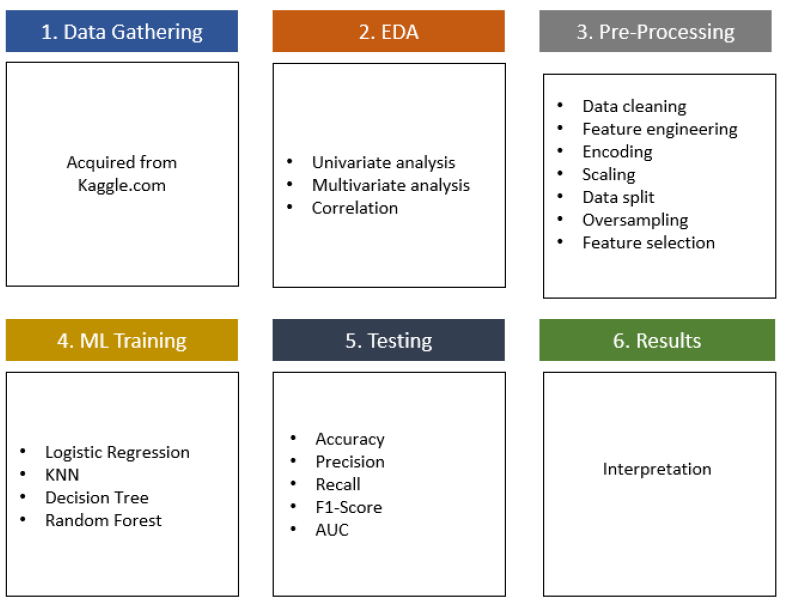
 
## EXPLORATORY DATA ANALYSIS (EDA)
The best way to understand the structure of a data is through visualization. This will help identify obvious errors, as well as better understand patterns within the data, detect outliers, find interesting relations among the variables. Two kinds of analysis were carried out on the features, univariate and multivariate analysis. Also, age, BMI, avergae glucose level were binned into groups for better understanding of the data.
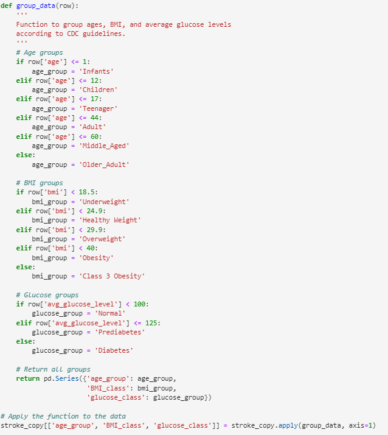
 
* Univariate analysis was carried out on each feature in the dataset to understand the distribution of each feature. The findings achieved in this analysis are listed below:
  - The dependent variable is highly imbalance. Observations for “No stroke” is 95%, and 5% for “stroke”.
  - The average age of patients is 43 years.
  - The average glucose level and BMI distribution is right skewed.
  - There are missing values in the BMI column.
  - The boxplot of the average glucose level shows there are outliers. The outliers in the boxplot are not really outliers, the values are real values, and they depict patients with diabetes.
  - In terms of categorical features (non-numeric), we have more female patients than males, less patients with hypertension than those that have, less patients with heart disease than those that have. All the categorical features distribution is shown in the figure below.
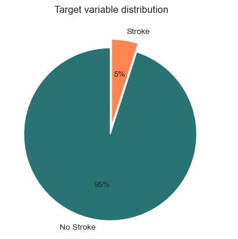 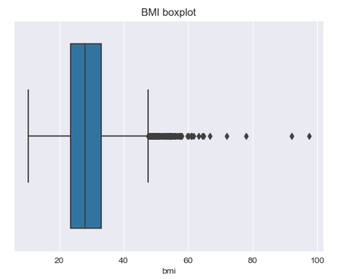
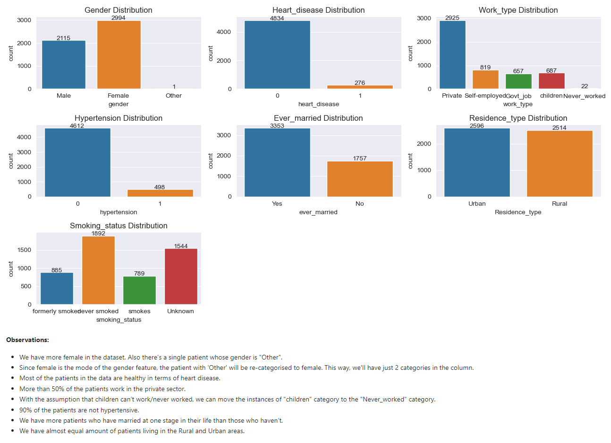

* Multivariate analysis was carried out between features to look for relationship, patterns between them. Some key insights gained from this analysis are listed below:
  - More patients that are older than 40 years seems to have stroke with little number of patients less than 40 years having stroke.
  - The males in the data tend to have stroke at age over 40, while women tend to have stroke from age around 30s.
  - There are two children (less than 18 years) that have stroke.
  - The underweight patients are the least class that has stroke, followed by the healthy weight class. 
  - Stroke seems to occur in patients with overweight, obesity, and class III obesity.
  - Combination of patients that formerly smoked and those that smokes have stroke than those that never smoked.
  - Patients with average glucose level higher than 150 and over 60 years old tends to have stroke.
  - Patients who are married at a point in their life have stroke than those that have never married.
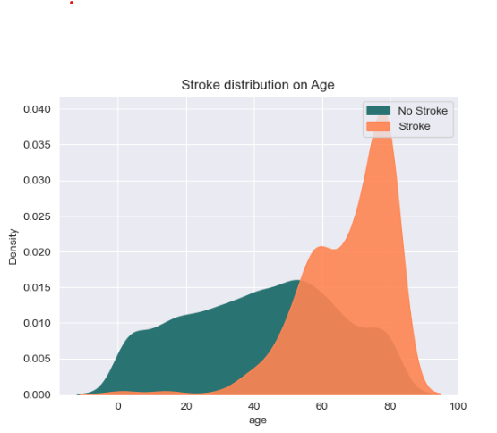 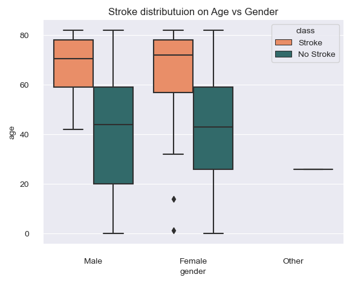 
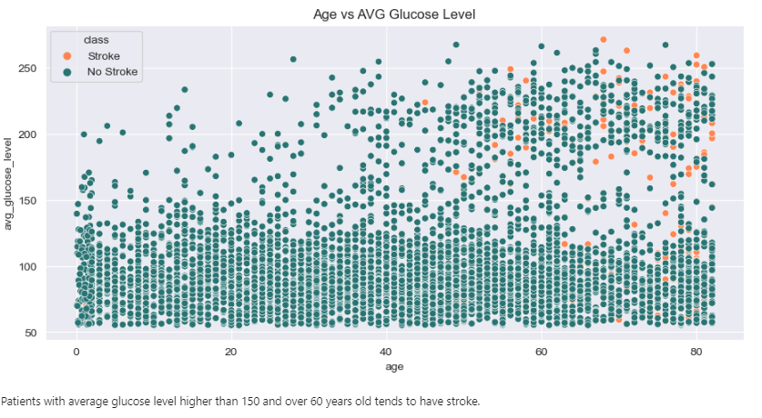
 
The correlation between variables was also checked using the correlation plot, and it was discovered that BMI is the least correlated with stroke, and age is the most correlated to stroke among the numerical features.
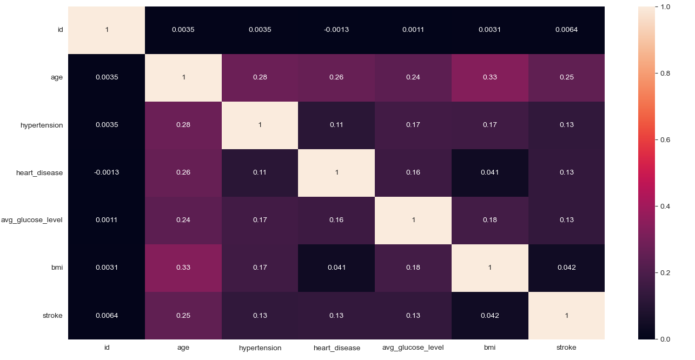

## DATA PRE-PROCESSING
### Data Cleaning
The EDA led to identifying inconsistencies in the data. Specifically, missing values were imputed using the median value of the BMI feature for the 201 missing observations. Additionally, the ID column, which was deemed irrelevant for the analysis, was dropped. Categorical data were also manipulated, with the gender value "other" being replaced with "female," as it was the mode in the corresponding column. Furthermore, individuals with “unknown” smoking status values who were younger than 18 years old were assumed to have never smoked, hence their smoking status was changed to “never_smoked”. Additionally, the "children" value in the "work_type" column was replaced with "never worked" as it was assumed that children had never worked. This resulted in four unique values in the column, down from the initial five.
### Feature Engineering and Transformation
Age, BMI, and glucose level features were subjected to feature binning. The calculation of BMI was based on the classification of (NHS, 2022), while the glucose level feature was categorized according to the classification of (Centre for Disease Control, 2023).
### Data Scaling & Splitting
For data scaling, the label encoding and one-hot encoding technique were applied. 
Label encoding is a technique used to convert ordinal categorical features into numerical values while preserving their order. It assigns a unique numeric label to each category based on its position in the order. On the other hand, one-hot encoding is applied to nominal features where there are no inherent orders among the categories. It represents each category as a binary vector, with each element indicating the presence or absence of that category. 
Label encoding was applied to ordinal categorical features to retain their order, while nominal features were one-hot encoded because there are no inherent orders in the categories. 
These actions increased the number of features from 11 to 23. To ensure the features are all in similar scale, the standardization method of scaling was employed.  
Furthermore, the data was split into training and test sets in a 70:30 ratio. This division allows for evaluating the model's performance on unseen data by training it on the larger training set and validating it on the smaller test set.
### Addressing Class Imbalance
To address the class imbalance, the Synthetic Minority Over-sampling Technique (SMOTE) was applied. This technique was introduced by (Chawla, et al., 2002). The technique works by generating synthetic data using the k-nearest neighbour (Wijaya, 2020). Only the training data was oversampled as seen in the figure below. This is to avoid data leakage and to ensure that the model generalizes well to unseen data.
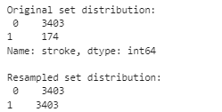
### Feature Selection
To identify the most relevant features for training the models, the Recursive Feature Elimination (RFE) technique was applied using a random forest classifier. RFE selects important features by iteratively removing unimportant ones until the desired number is reached, enhancing model performance and interpretability, and reducing overfitting. The importance of each feature is determined by the model's feature importance scores, which can be obtained from models like Random Forest or other tree-based algorithms (Munir, et al., 2021). The top 10 features were selected as seen below. 
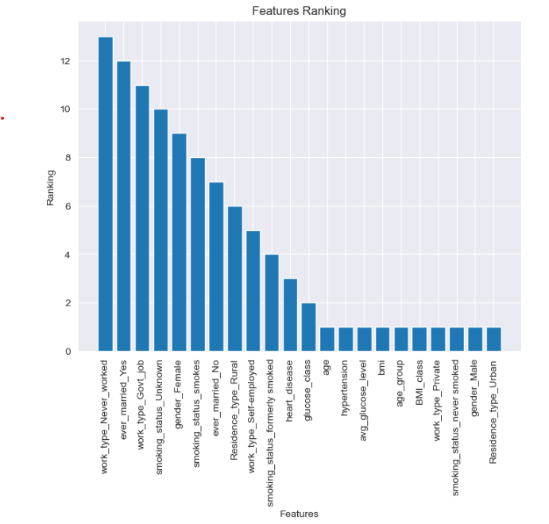

## MACHINE LEARNING ALGORITHMS & EVALUATION
In this experiment, four machine learning (ML) algorithms, namely Logistic Regression, Decision Tree, K-Nearest Neighbour, and Random Forest, were trained and evaluated. The algorithms were carefully tuned to find their optimal parameters, aiming to achieve the best possible results. To assess the performance of these algorithms, a set of evaluation metrics was employed. These metrics include accuracy, recall, precision, f1-score, and area under the curve (AUC). 
* Accuracy is a measure of the overall correctness of the predictions made by the models. It calculates the proportion of correct predictions among the total number of predictions. 
* Recall, also known as sensitivity or true positive rate, measures the ability of the models to correctly identify positive instances from the total number of actual positive instances. It focuses on minimizing false negatives. 
* Precision quantifies the accuracy of positive predictions by considering the proportion of true positive predictions among the total number of positive predictions made by the models. It aims to minimize false positives. 
* F1-score combines both precision and recall into a single metric. It provides a balanced assessment of the models' performance by considering both false positives and false negatives. 
* AUC, or the area under the receiver operating characteristic (ROC) curve, is a measure of the model's ability to distinguish between positive and negative instances. It captures the trade-off between true positive rate and false positive rate across various probability thresholds. A higher AUC indicates better discrimination performance of the models. 
By utilizing these evaluation metrics, a comprehensive analysis of the ML algorithms' performance can be conducted, enabling the selection of the most effective algorithm for the given task.

## RESULTS
The table below shows the performance of the four classifiers in predicting the occurrence of stroke.

| Model | Accuracy | Precision | Recall | F1 | AUC |
|-------|----------|-----------|--------|----|-----|
| Logistic Regression   | 0.72     | 0.13      | 0.87   | 0.23 | 0.85 |
| KNN                   | 0.89     | 0.10      | 0.17   | 0.13 | 0.55 |
| Decision Tree         | 0.89     | 0.15      | 0.27   | 0.19 | 0.59 |
| Random Forest         | 0.92     | 0.18      | 0.19   | 0.18 | 0.83 |

## DISCUSSION
Precision and recall are indeed critical metrics in medical diagnosis, as false positive and false negative predictions can have serious consequences. In the context of stroke prediction, it is important to accurately identify stroke cases to ensure appropriate interventions and timely treatment. 
The results of the models in terms of precision, recall, F1-score, and AUC indicate that they faced challenges in correctly identifying stroke cases. This can be attributed to the significant class imbalance between non-stroke and stroke instances in the test set, with a much larger number of non-stroke (1458) instances compared to stroke (75) instances. This class imbalance creates a bias in the models towards predicting the majority class, which in this case is non-stroke. 
Among the models, logistic regression stands out with a high recall of 0.87. This suggests that the model was successful in correctly identifying a large proportion of the actual stroke cases in the dataset. However, the low precision value indicates that the model also classified a considerable number of non-stroke cases as strokes, resulting in a high rate of false positive predictions. 
On the other hand, the remaining models, including KNN, decision tree, and random forest, demonstrate relatively lower values for precision, recall, F1-score, and AUC. These models seem to perform better in predicting non-stroke cases accurately rather than identifying stroke cases. 
 
In conclusion, the results suggest that logistic regression and random forest have potential for predicting strokes, with random forest showing the most promising performance. These findings have implications for healthcare providers, as accurate prediction of strokes can help in early identification, prevention, and appropriate allocation of resources for stroke management.

## FUTURE WORK
A potential future work could be to investigate the impact of other features on stroke diagnosis such as environmental factors, genetic predispositions, race, stress levels, and lifestyle habits. They could improve the performance of stroke diagnosis using machine and deep learning algorithms.

